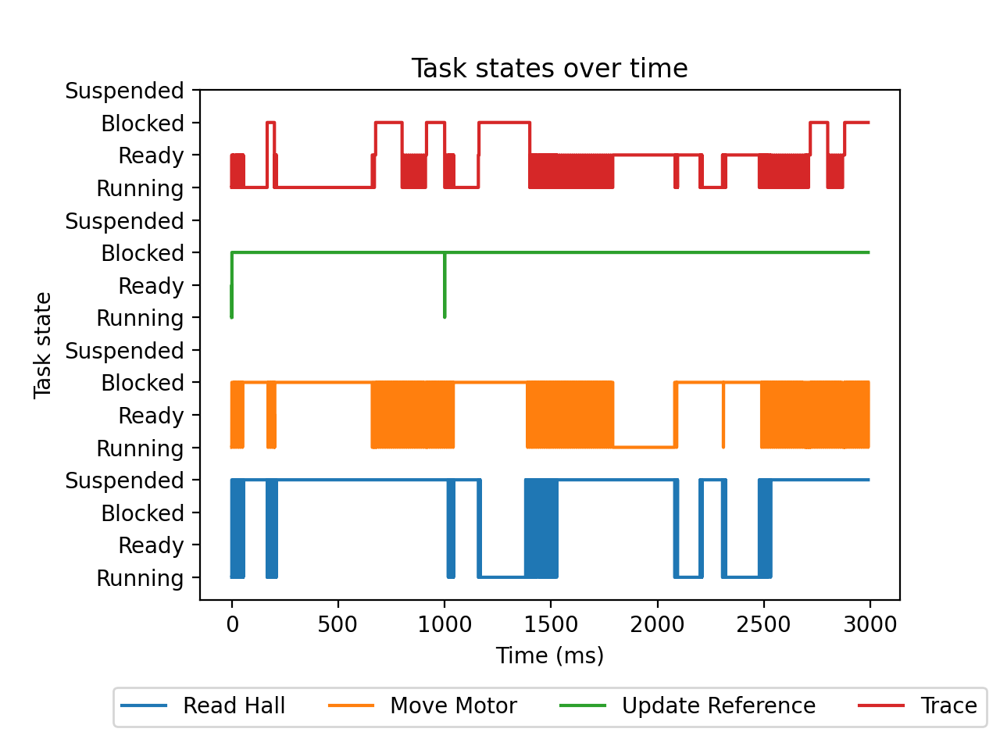
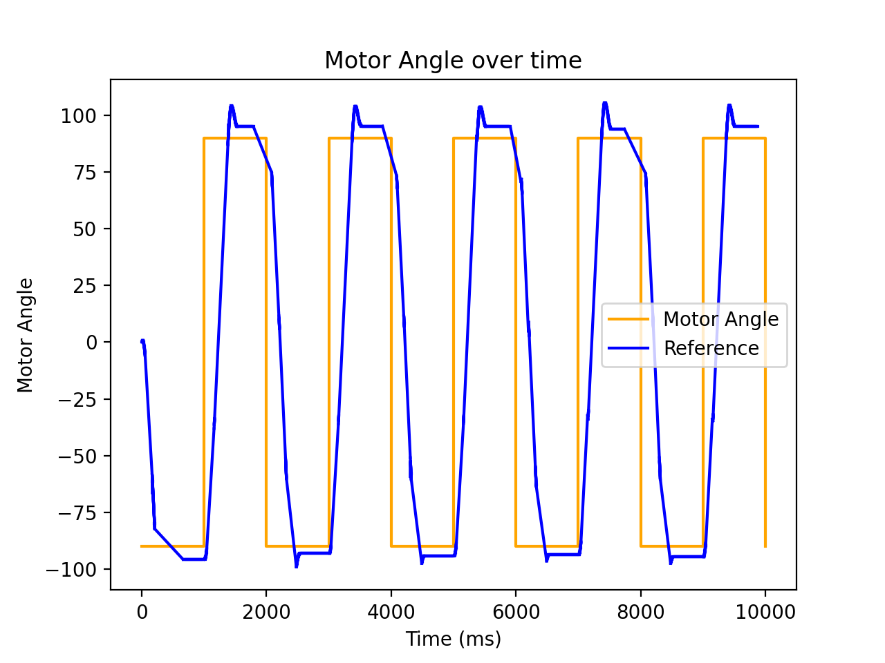
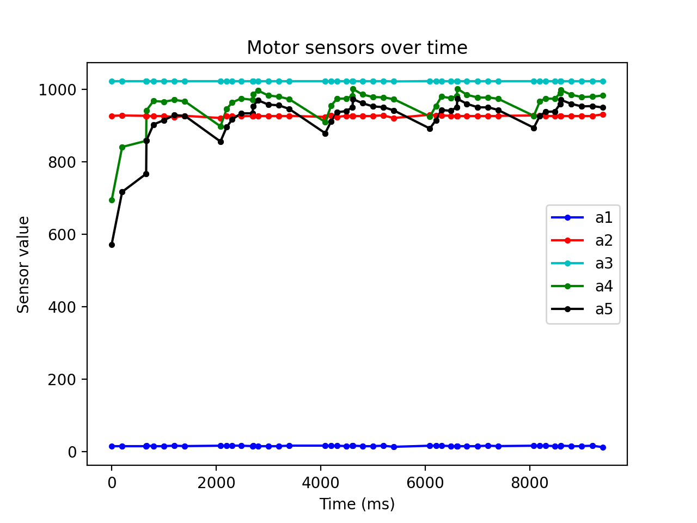

# Lab 3 - Motor Position Control
> Ziang Dai i Liam Garriga

Temps Màxim de Comput de les tasques:
```
       ReadHall: 0.214310 seconds
      MoveMotor: 0.399730 seconds
UpdateReference: 0.000130 seconds
          Trace: 0.117010 seconds
```

Podem veure que tant la tasca `ReadHall` com `MoveMotor` sobrepassen el seu deadline per molt.  
Creiem que pot ser perquè la tasca `ReadHall` (que s'activa amb l'interrupt de l'encoder ) té una prioritat més alta 
que `MoveMotor`, fet que causa que la tasca `MoveMotor` tardi molt en finalitzar.

Amb els grafs de les tasques es pot veure clarament a la zona taronja:


D'altra banda, aquest fet no té cap efecte a simple vista, semblant que el motor es mou com hauria.

Això es reforça amb el graf del moviment del motor, on podem observar que segueix la referència força d'aprop:



Les irregularitats de la part superior i inferior del graf són molt probablement degudes a un PID insuficientment ajustat.

I finalment com a curiositat podem veure l'estat dels sensors cada 200ms:

