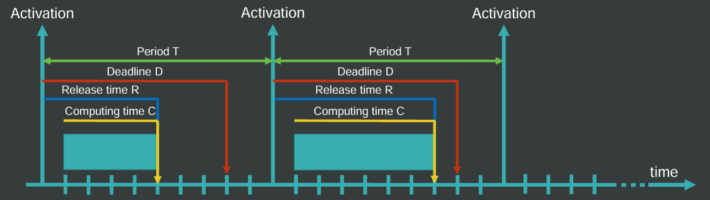
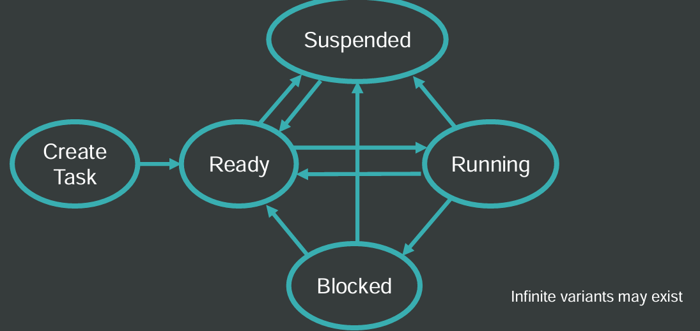

<!-- title: STR | Introduction -->

# Real Time Systems: Introduction <!-- omit from toc -->

## Index <!-- omit from toc -->

- [Introduction](#introduction)
- [Embedded System](#embedded-system)
- [Concepts](#concepts)
  - [Notation](#notation)
    - [Notation: tasks](#notation-tasks)
    - [Notation: Compute Time](#notation-compute-time)
    - [Notation: Deadline](#notation-deadline)
    - [Notation: Period](#notation-period)
  - [Time Requirements](#time-requirements)
    - [Period](#period)
    - [Deadline](#deadline)
    - [Computing Time](#computing-time)
    - [Release Time](#release-time)
  - [Missing Deadline Effects](#missing-deadline-effects)
  - [Task States](#task-states)
  - [Other Concepts](#other-concepts)
- [Summary](#summary)
  - [What's A Real Time System?](#whats-a-real-time-system)
  - [Why is RTS Needed?](#why-is-rts-needed)
  - [What Differs between _hard_ and _soft_ RTS?](#what-differs-between-hard-and-soft-rts)
  - [What is a _task_?](#what-is-a-task)
  - [What is a _period_?](#what-is-a-period)
  - [Main Concepts](#main-concepts)

## Introduction

For a system to be considered _real-time_ is is required that it can **guarantee** time requirements. For example:

- Actions that a headlight can do must be completed in less than 20ms
- Time from no power to full power should be completed in less than 5ms

This can seem unintuitive since a _fast_ system could comply with this requirement, but the main difference is that in RTS, the **time elapsed** for a [**task**](#what-is-a-task) is bounded.

## Embedded System

An _embedded system_ is a computer system that **performs specific tasks**. It differs from traditional operating system in that it **is not generic**, only able to **perform a specific task**, and lastly, it is generally **built to fulfill Real-Time requirements**.

## Concepts

### Notation

#### Notation: tasks

Each task is denoted as $\tau_{i}$. The basic information we need about each task is:

- It's [computing time](#computing-time)
- It's [period](#period)
- It's [deadline](#deadline)

#### Notation: Compute Time

The compute time is denoted as $C$. It might also be denoted as $c$

#### Notation: Deadline

A deadline is denoted as $D$. $d$ refers to the [absolute deadline](./T3.md#absolute-deadline).

#### Notation: Period

A period is denoted as $T$. $t$ refers to a time.

### Time Requirements

For any task we have a series of _time concepts_

#### Period

A period $T$ indicates a **fixed** periodically repeating time frame that tasks must be executed. The task itself does not need to be executed right at the start of a period, but must be done before it send.

#### Deadline

A deadline $D$ is a time limit within the [period](#period) where the task must be executed before reaching it. It can be the same as the period or earlier.

#### Computing Time

The _computing time_ $C$ is the time that it takes for a task to execute itself.

#### Release Time

The _release time_ is the time until the task is executed after the start of a [period](#period)

### Missing Deadline Effects

The effects of missing a deadline varies from the Real-Time model.

### Task States

A task always has a **state** associated to it. This state it is used to indicate the task's life-cycle. All task can be in one of these states:

- **Ready**: It is ready to be ran or suspended
- **Running**: It currently is being executed
- **Suspended**: It's not being executed
- **Blocked**

Generally, the task life-cycle is the following:

### Other Concepts

A list of other keywords and concepts:

- Schedulers:
  - Cyclic
  - Rate Monotonic
  - Deadline Monotonic
  - Earliest Deadline First
  - Earliest Due Date
- Worst Case Execution Time ($WCET$)
- Real-Time Operating System (RTOS)
- Task related:
  - Latency
  - Jitter
  - Granularity
- Priorities:
  - Fixed and dynamic priorities
  - Priority inversions
- Task execution:
  - Critical Section ($CS$)
  - Resource Allocation

## Summary

### What's A Real Time System?

A Real Time System is a system where the _task completion time_ must be **bounded**.

### Why is RTS Needed?

It guarantees safety and critical timing constraints

### What Differs between _hard_ and _soft_ RTS?

A **hard** RTS has strict time requirements on _Deadline_ requirements. While a **soft** RTS has more loose requirements over it.

### What is a _task_?

A task is a piece of code that the system executes.

### What is a _period_?

A period is a consistent and repeating time window. The duration depends on the [task](#what-is-a-task) itself

### Main Concepts

See [Concepts](#concepts).
