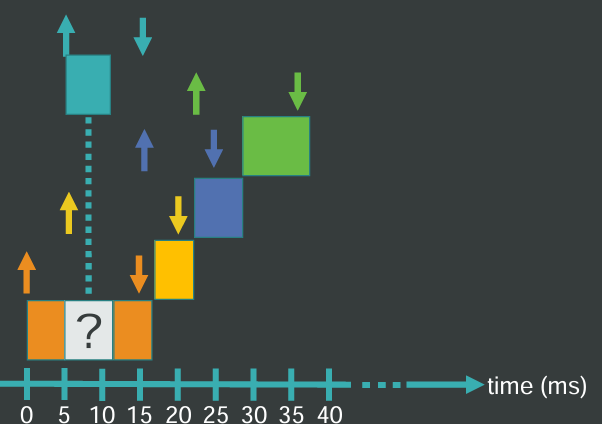
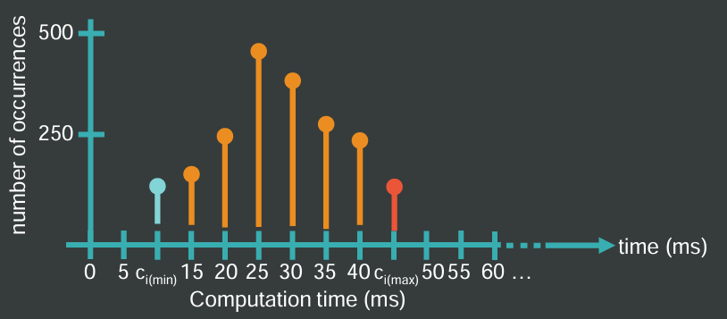

<!-- title: STR | Basics -->

# Real Time Systems: Basics <!-- omit from toc -->

## Index <!-- omit from toc -->

- [Introduction](#introduction)
- [Utilization Factor](#utilization-factor)
- [Domino Effects](#domino-effects)
  - [Preemption](#preemption)
  - [Faster Processor](#faster-processor)
  - [Multiprocessing](#multiprocessing)
- [Risk Assessment](#risk-assessment)
- [Worst Case Execution Time](#worst-case-execution-time)

## Introduction

For a [Real Time System](./T1.md#introduction) to work it needs to execute [tasks](./T1.md#what-is-a-task) [periodically](./T1.md#what-is-a-period). These tasks must be **organized** following an order, making sure that all the tasks can be scheduled within their required _periods_ and _deadlines_.

## Utilization Factor

The basic method to determine if a set of task are possible to be scheduled is by calculating the _utilization factor_ $U$. This factor indicates how much time it will take on the cpu.

$$
U_{i} = \frac{c_{i}}{T_{i}}
$$

Given that this is indicates the proportion of the cpu time that it will use, we need to make sure that all factors added up are less or equal than $1$.

$$
\begin{align*}
    U_{\text{total}}&=\sum^{n}_{i=1}U_{i}
    \\
    U_{\text{total}} &\le 1
\end{align*}
$$

This condition is _necessary_ but not _sufficient_. A set of tasks might comply with the total factor being less than 1, but still not able to be scheduled.

## Domino Effects

Given that tasks needs to do different tasks, they might enter into conflict with each other. In those situations, the task orders are handled differently.

### Preemption

A task that is _running_ might need to give way for another task. Essentially, the running task will need to stop running and switch context to the newer task, and once it completes, keep on going.

This is a kernel mechanism that suspends the running task in favor of another task. It might help improving response time by running more important tasks or using better the wait time of the task.

This switch might induce problems related with data consistency, but it can be fixed depending on how it is implemented.

### Faster Processor

Given the same set of tasks, that are possible to be scheduled using an initial processor, changing it for a faster one can lead to situations where they are not able to be scheduled.

### Multiprocessing

Given a set of tasks that are able to be scheduled using a single processor, adding another one might not guarantee it will also be schedulable. Mainly due to processor interaction issues.

## Risk Assessment

Due to how sensitive Real Time Systems are, it is very important to make sure that any hardware or software changes will not affect the schedulability of a set of tasks.

## Worst Case Execution Time

Each time might do the same series of actions, but the overall execution time might vary. Usually the execution time follows a distributed pattern, meaning it is possible to determine the worst execution time of it.

This metric is important because it determines the [deadline](./T1.md#deadline) of the task. Keep in mind that this metric only takes into account execution time. Any other time spent on processes other than execution is not accounted. The best way to keep track of them, is to treat them as a task.

Since [task preemption](#preemption) is a thing, it must be noted that task exclusion can affect this metric, since if it cannot access to a resource due to it being blocked by another task, it's computing time is increased.
