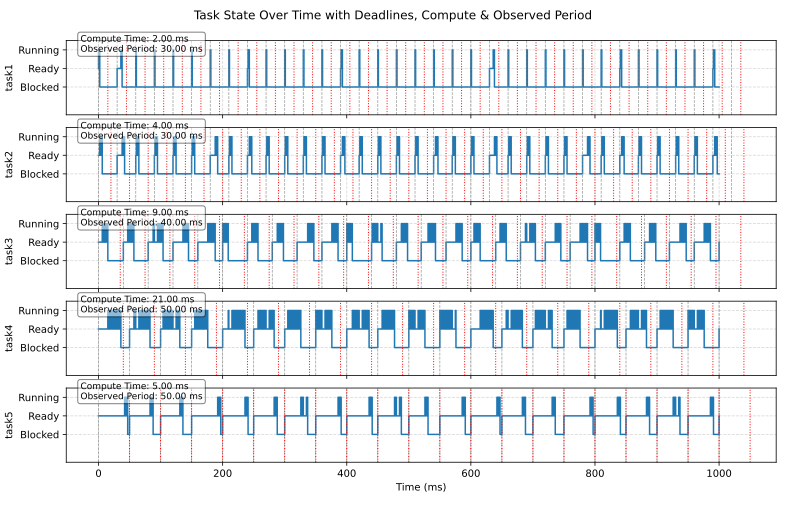

> Liam Garriga Rosés

# Implementació d'EDF a FreeRTOS
Per implementar el planificador, he creat una tasca de màxima prioritat `Task9Scheduler` que modifica les prioritats de les tasques principals dinàmicament.

Per tal de facilitar la experiència d'usuari, les tasques es defineixen a la llista `Tasks`, on s'indica la funció que executarà aquella tasca, juntament amb el `compute time`, `deadline` i `period`.

Només amb aquesta informació el planificador crearà totes les estructures necessàries per la correcta execució i traça del programa.

### Funcionament del planificador
El planificador manté un recompte de la `deadline` de cada tasca, i, com que s'executa a cada `tick` del sistema operatiu, la pot decrementar (funció `updateTasks`).

Funcionar amb ticks en comptes de temps permet ser molt més precís, ja que és una mètrica que el propi sistema ens dona.  
D'aquesta manera podem evitar `str_getTime`, que és només una aproximació i pot generar error.

Un cop calculats els ticks que queden pel `deadline` de cada tasca ordenem la nostra llista (`sortTasks`) i assignem les prioritats (`setTaskPriorities`), tenint les tasques amb el `deadline` més aprop una prioritat més alta.

Si alguna de les tasques ha perdut el seu `deadline`, es para el programa immediatament i s'imprimeix un missatge d'error (`deadlineMissed`).

Per assegurar que el planificador s'executa cada `tick`, el cridem des de `vApplicationTickHook`, que com el nom indica és una funció que el sistema corre cada `tick`.

### `Trace` del programa i dibuixat del gràfic de tasques
A cada canvi de context, `str_trace` guarda l'estat de cada tasca a `circ_buffers`, juntament amb el `tick` en el que hi ha hagut aquest canvi.

Al final del programa s'imprimeix la traça (`OneShotTimerCallback`), on també s'indica el temps màxim i acumulat de les tasques `trace` i `scheduler`.

Per mostrar el gràfic de l'execució del programa, executa l'script de Python:
```sh
python graph.py
```
L'script automàticament llegirà l'últim `log` i dibuixarà el gràfic corresponent.

### Exemple d'execució en 1000 ms



## Dificultats trobades
Una de les dificultats més grans que m'he trobat mentre implementava el planificador ha estat la cache de codi.

Quan encara estava dissenyant l'algoritme de planificació, em vaig adonar que si canviava algunes parts molt concretes del codi les tasques perdien el seu `deadline`, encara que no hi havia cap canvi a nivell llògic.

Per exemple, la funció `sortTasks` ha acabat estant separada en una funció a part, perquè si escrivia el codi dins del planificador provocava aquest error.

La meva teoria és que el compilador deu fer `loop unrolling`, encara que estigui optimitzant per la mida (`Os`).  
Això causa que la cache de codi s'empleni, i per tant l'execució resulta més lenta.  
Com que tenim la CPU al límit (97%), un petit canvi pot afectar molt.

Una altra funcionalitat que causava aquest error era `deadlineMissed`.  
En un principi aquest codi també estava dins de `Task9Scheduler`, però vaig observar que si movia la funcionalitat a una altra funció les tasques tornaven a la normalitat.  
Tot i així, es continua comprovant si s'ha perdut un `deadline`, i es pot comprovar augmentant el temps de còmput d'alguna tasca.

---

Probablement per la mateixa raó, algunes optimitzacions algorítmiques no semblen millorar el rendiment.  

A l'arxiu `src/main_logically_optimized.cpp.test` pots trobar un intent d'optimització on es millora l'algoritme d'ordenació de tasques per tal que només s'executi quan es reactiva una tasca (passa de `remaining_deadline == 0` a `remaining_deadline == deadline`).  
A més a més, només s'ordena aquella tasca concreta en comptes de totes, i s'aprofita aquell bucle per actualitzar les prioritats.

Llògicament aquests passos haurien de resultar en una millora considerable (no ordenem les tasques cada tic), però acaba sent més lent.

> No Optimitzat (7000 ms)

```
Samples: 14929
System Startup Time: 0.90
Max Trace Time: 0.0024414063
Acc Trace Time: 13.91
Max Sched Time: 0.0039452910
Acc Sched Time: 22.52
```

> Optimitzat (7000 ms)

```
Samples: 14929
System Startup Time: 0.90
Max Trace Time: 0.0024414063
Acc Trace Time: 33.25
Max Sched Time: 0.0048828125
Acc Sched Time: 19.45
```

Com es pot veure, encara que el temps acumulat del planificador baixa lleugerament, el temps del traçat pràcticament es triplica.  
No només això, sino que el temps màxim del planificador ha augmentat, probablement degut a la inclusió de branques (només s'ordena en casos específics).